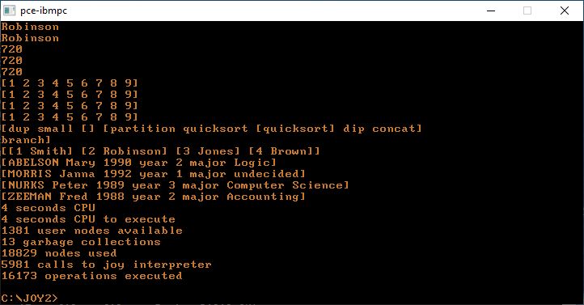
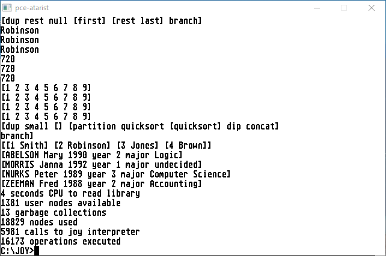
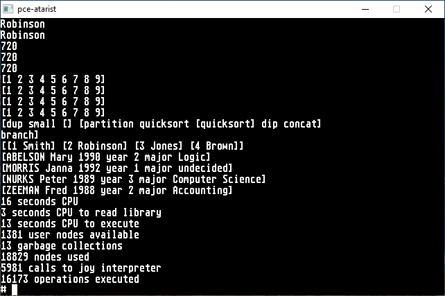
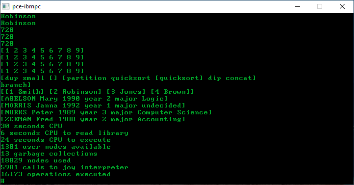

 
==============

42minjoy
========

This is a small version of Joy and because of that has fewer bugs than the full
version.

The reason for maintaining this version of Joy is that it is an order of
magnitude smaller than the full version.

And it has some features that are not present in full Joy, such as scantime
expression evaluation.

Retro
=====

This version lends itself to be implemented on old machines, precisely because
it is small. It so happened that one of the environments comes with an K&R C
compiler, so that is why the sources needed to be changed. Modern compilers
can still handle K&R. C99 requires them to give a warning. That warning can be
ignored.

MS-DOS 3.3
----------

The first example runs MS-DOS 3.3 on a PC.

 

TOS 1.04
--------

The second example runs TOS 1.04 on an Atari ST.

 

Minix 1.5
---------

The third example runs Minix 1.5 on an Atari ST.
It is this environment that uses a K&R C compiler.

 

Minix 2.02
----------

The fourth example runs Minix 2.02 on a PC.
This is the last version of Minix that can be run
on an original 8088 machine.

 

Comments
--------

Compiling on old machines shows that the software is portable.

Speed of execution is not so relevant anymore.
